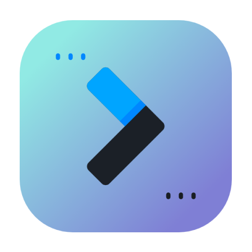

<p align="center">
  
</p>

<h1 align="center">Slidefy</h1>
<p align="center">A slideshow focused on reading markdown files.</p>

<h3 align="center">
  <!-- Version -->
  <a href="https://github.com/maykbrito/mini-video-me/releases">
    
  </a>  
  
 <!-- License -->
  <a href="./LICENSE" target="_blank">
    
  </a>
</h3>

<br />

# Installation

- [Download](https://github.com/fsrocha-dev/slidefy/releases)

⚠️ **For MacOS**, move the extracted app to the **Applications** folder, open your terminal and run the following command to sign the app
```bash
codesign --force --deep --sign - /Applications/Slidefy.app
```
Wait until the command finishes, then open the app.

# Usage & settings

After running the app, you can create a new document in which you must follow the markdown syntax! to separate the slides, use `---` to indicate that you want to start a new slide page within your presentation. Writing your presentation, just hit play on the top bar.

## Default shortcuts

<table>
  <thead>
    <tr>
      <th>MacOS</th>
      <th>Linux / Windows</th>
      <th>Function</th>
      <th>Window must be focused</th>
    </tr>
  </thead>
  <tbody>
    <tr>
      <td><kbd>Command</kbd> + <kbd>k</kbd></td>
      <td><kbd>Ctrl</kbd> + <kbd>k</kbd></td>
      <td>Open search document bar</td>
      <td>Yes</td>
    </tr>
  </tbody>
</table>

# Next features

- Custom themes
- Window settings
- Folders separator

# Contributing

Clone de repository, open its folder and install dependencies with:

```sh
npm install
```

Run it using:

```sh
npm run dev
```

# Author

👤 **Frank Rocha**

- LinkedIn: [@frankrochadev](https://linkedin.com/in/frankrochadev)
- Github: [@fsrocha-dev](https://github.com/fsrocha-dev)
- Twitter: [@frankrocha_dev](https://twitter.com/frankrocha_dev)

## Show your support

Give a ⭐️ if this project helped you!
